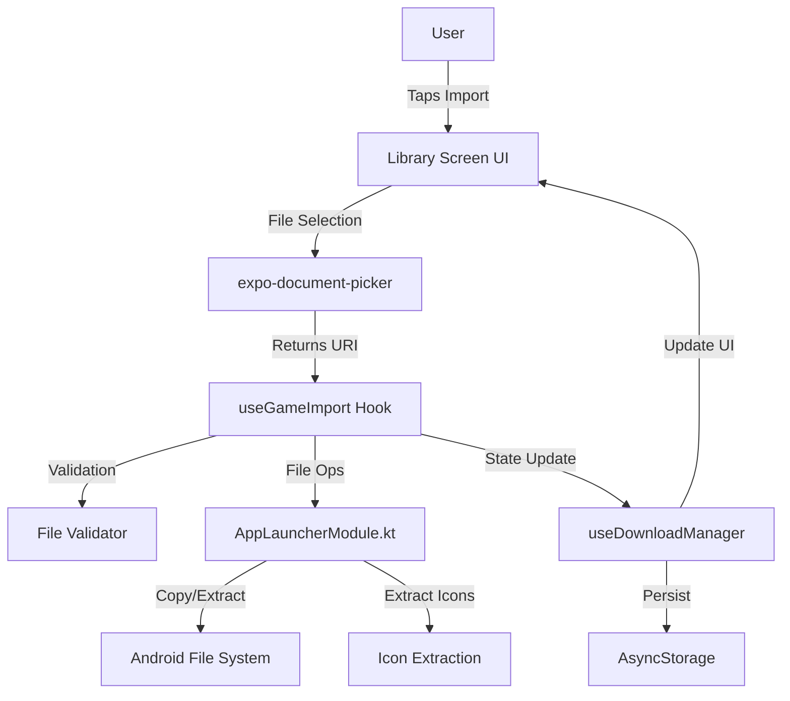
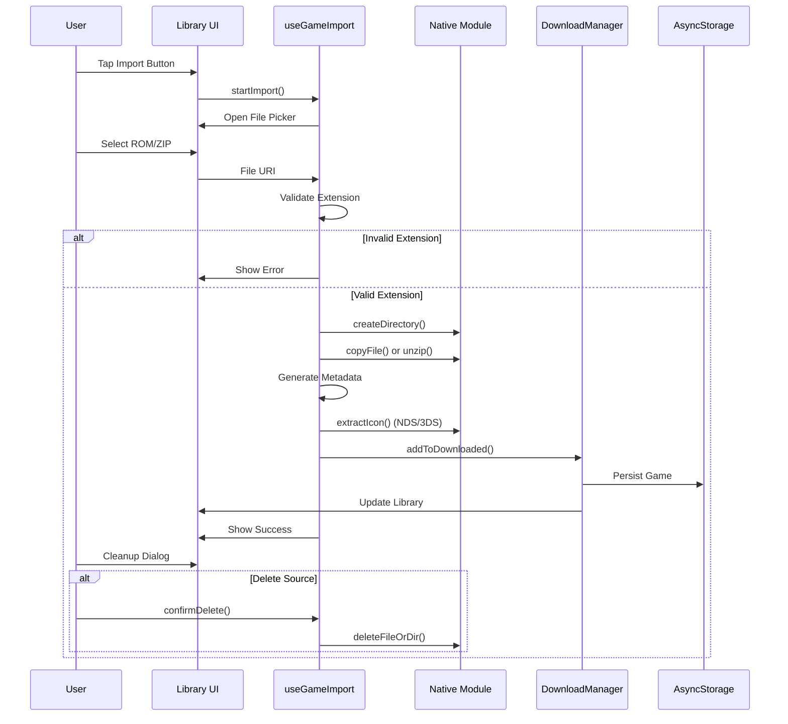

# Design Document: Game Import Feature

## Overview

The Game Import feature enables users to import ROM files (GBA, NDS, 3DS) from their device's local storage into the Alga Emulator Launcher game library. The feature supports both raw ROM files and ZIP archives, performs validation, extracts metadata and cover images, and provides optional cleanup of source files after successful import.

### Key Design Principles

1. **3-Layer Architecture**: Clear separation between UI (React Native), business logic (TypeScript hooks), and native operations (Kotlin)
2. **Immediate Integration**: Imported games appear instantly in the library without requiring app restart
3. **Robust Error Handling**: Each layer handles errors appropriately with user-friendly messages
4. **Progress Transparency**: Users see clear status updates during the import process
5. **Storage Efficiency**: Optional source file cleanup to save device storage

### Design Goals

- Seamless integration with existing game management system (useDownloadManager)
- Reuse existing native functions where possible (file operations, icon extraction)
- Maintain consistency with existing UI patterns and styling
- Support both single ROM files and ZIP archives containing multiple ROMs
- Provide clear validation feedback before committing changes

## Architecture

### System Context



### Layer Responsibilities

#### Layer 1: UI Layer (library.tsx)
- Display import button in header toolbar
- Trigger file selection dialog
- Show progress indicators during import
- Display success/error messages
- Show source file cleanup confirmation dialog

#### Layer 2: Business Logic Layer (useGameImport.tsx)
- Orchestrate the import workflow
- Validate file extensions and formats
- Generate unique game IDs and metadata
- Coordinate with useDownloadManager for state updates
- Handle error propagation and user feedback
- Manage import progress state

#### Layer 3: Native Layer (AppLauncherModule.kt)
- Perform file system operations (copy, extract, delete)
- Extract cover images from NDS/3DS ROMs
- Handle ZIP file extraction
- Provide low-level file validation

### Data Flow



## Components and Interfaces

### 1. useGameImport Hook

**Location**: `src/hooks/useGameImport.tsx`

**Purpose**: Orchestrate the game import workflow, manage import state, and coordinate between UI and native layers.

**Interface**:

```typescript
interface ImportState {
  isImporting: boolean;
  progress: number; // 0-1
  currentOperation: 'idle' | 'validating' | 'copying' | 'extracting' | 'processing' | 'done';
  error: string | null;
}

interface ImportResult {
  success: boolean;
  game?: ApiGame;
  sourceFilePath?: string;
  error?: string;
}

interface UseGameImportReturn {
  importState: ImportState;
  startImport: (emulatorId: string) => Promise<ImportResult>;
  cancelImport: () => void;
  deleteSourceFile: (filePath: string) => Promise<boolean>;
}

export function useGameImport(): UseGameImportReturn;
```

**Key Functions**:

- `startImport(emulatorId)`: Initiates the import workflow
  - Opens file picker with appropriate MIME types
  - Validates selected file
  - Orchestrates copy/extraction
  - Generates metadata
  - Triggers icon extraction
  - Updates download manager
  - Returns import result

- `validateFile(uri, filename)`: Validates file format
  - Checks extension against supported formats
  - Maps extension to platform and emulator
  - Returns validation result with error message if invalid

- `generateGameMetadata(filename, platform, romPath)`: Creates game metadata
  - Generates unique negative ID (hash-based)
  - Cleans filename to extract game name
  - Creates ApiGame object with required fields

- `deleteSourceFile(filePath)`: Deletes source file after import
  - Calls native deleteFileOrDir
  - Returns success/failure status

### 2. Native Module Extensions

**Location**: `modules/app-launcher/android/src/main/java/expo/modules/applauncher/AppLauncherModule.kt`

**New Functions Required**: None - all required functions already exist:
- `createDirectory(path)`: Create game folder
- `copyFile(srcPath, destPath)`: Copy ROM file
- `deleteFileOrDir(path)`: Delete source file
- `extractNdsIcon(romPath, outputPath)`: Extract NDS cover
- `extract3dsIcon(romPath, outputPath)`: Extract 3DS cover
- `fileExists(path)`: Check file existence
- `listFiles(dirPath)`: List files in directory

**ZIP Extraction**: Use existing `react-native-zip-archive` library's `unzip()` function.

### 3. UI Components

**Location**: `src/app/library.tsx`

**Import Button**:
```typescript
<TouchableOpacity
  onPress={() => importGame()}
  className="w-10 h-10 rounded-full bg-white/10 items-center justify-center"
>
  <Upload size={20} color={PRIMARY} />
</TouchableOpacity>
```

**Progress Indicator**:
```typescript
{importState.isImporting && (
  <View className="absolute inset-0 bg-black/80 items-center justify-center">
    <ActivityIndicator size="large" color={PRIMARY} />
    <Text className="text-white mt-4">{getOperationText(importState.currentOperation)}</Text>
  </View>
)}
```

**Source File Cleanup Dialog**:
```typescript
<CustomAlert
  visible={showCleanupDialog}
  icon="🗑️"
  title="Xóa file gốc?"
  message={`Bạn có muốn xóa file gốc để tiết kiệm dung lượng?\n\n${sourceFilePath}\n${formatFileSize(sourceFileSize)}`}
  confirmText="Xóa"
  cancelText="Giữ lại"
  confirmColor="#ef4444"
  onConfirm={handleDeleteSource}
  onCancel={() => setShowCleanupDialog(false)}
/>
```

## Data Models

### ApiGame Interface (Existing)

```typescript
interface ApiGame {
  id: number;           // Negative integer for imported games
  name: string;         // Cleaned game name
  platform: string;     // 'gba' | 'nds' | '3ds'
  filename: string;     // Original filename with .zip extension
  downloadUrl: string;  // Empty string for imported games
  size: number;         // File size in bytes (0 for imported)
}
```

### Platform Mapping

```typescript
const PLATFORM_CONFIG = {
  gba: {
    emulatorId: 'mgba',
    extensions: ['.gba'],
    extractIcon: false,
  },
  nds: {
    emulatorId: 'melonds', // or 'desmume'
    extensions: ['.nds'],
    extractIcon: true,
    iconExtractor: extractNdsIcon,
  },
  '3ds': {
    emulatorId: 'citra',
    extensions: ['.3ds', '.cci', '.cxi', '.3dsx'],
    extractIcon: true,
    iconExtractor: extract3dsIcon,
  },
};
```

### File Paths

```typescript
const PATHS = {
  romsBase: '/storage/emulated/0/Alga/roms',
  covers: '/storage/emulated/0/Alga/covers',
  getRomDir: (emulatorId: string, gameFolder: string) => 
    `${PATHS.romsBase}/${emulatorId}/${gameFolder}`,
  getCoverPath: (gameId: number) => 
    `${PATHS.covers}/${gameId}.png`,
};
```

### Import State Machine

```typescript
type ImportOperation = 
  | 'idle'        // No import in progress
  | 'validating'  // Checking file format
  | 'copying'     // Copying raw ROM file
  | 'extracting'  // Extracting ZIP archive
  | 'processing'  // Generating metadata, extracting icon
  | 'done';       // Import complete

const OPERATION_MESSAGES: Record<ImportOperation, string> = {
  idle: '',
  validating: 'Đang kiểm tra file...',
  copying: 'Đang sao chép ROM...',
  extracting: 'Đang giải nén...',
  processing: 'Đang xử lý metadata...',
  done: 'Hoàn tất!',
};
```

## Error Handling

### Error Categories

1. **Validation Errors** (User-facing, non-critical)
   - Unsupported file extension
   - ZIP contains no valid ROMs
   - File picker cancelled

2. **File System Errors** (User-facing, critical)
   - Insufficient storage space
   - Permission denied
   - Source file not found
   - Copy/extract failed

3. **Metadata Errors** (User-facing, critical)
   - AsyncStorage write failed
   - State update failed

4. **Icon Extraction Errors** (Silent, non-critical)
   - Icon extraction failed (continue import)
   - Cover directory creation failed

### Error Handling Strategy

```typescript
try {
  // Validation phase
  const validation = validateFile(uri, filename);
  if (!validation.valid) {
    return { success: false, error: validation.error };
  }

  // File operation phase
  updateState({ currentOperation: 'copying' });
  const romPath = await copyOrExtractFile(uri, destDir);
  
  // Metadata phase
  updateState({ currentOperation: 'processing' });
  const game = generateGameMetadata(filename, platform, romPath);
  await downloadManager.addToDownloaded(game);
  
  // Icon extraction (non-blocking)
  extractIconSilently(romPath, game.id, platform).catch(() => {
    // Log but don't fail import
    console.warn('Icon extraction failed for game', game.id);
  });
  
  return { success: true, game, sourceFilePath: uri };
  
} catch (error) {
  // Cleanup partial import
  await cleanupFailedImport(destDir);
  
  // Map error to user-friendly message
  const userMessage = mapErrorToMessage(error);
  return { success: false, error: userMessage };
}
```

### Error Messages

```typescript
const ERROR_MESSAGES = {
  UNSUPPORTED_FORMAT: 'Định dạng file không được hỗ trợ. Vui lòng chọn file .gba, .nds, .3ds, .cci, .cxi, .3dsx hoặc .zip',
  NO_VALID_ROMS: 'File ZIP không chứa ROM hợp lệ',
  INSUFFICIENT_STORAGE: 'Không đủ dung lượng lưu trữ',
  PERMISSION_DENIED: 'Không có quyền truy cập file',
  COPY_FAILED: 'Không thể sao chép file ROM',
  EXTRACT_FAILED: 'Không thể giải nén file ZIP. File có thể bị hỏng',
  METADATA_FAILED: 'Không thể lưu thông tin game',
  UNKNOWN: 'Đã xảy ra lỗi không xác định',
};
```

## Testing Strategy

### Property-Based Testing Assessment

**Property-based testing is NOT appropriate for this feature** because:

1. **Heavy I/O Operations**: The feature primarily involves file system operations (copy, extract, delete) which are side-effect heavy and not suitable for property-based testing
2. **External Dependencies**: Testing requires interaction with native modules, document picker, and ZIP extraction libraries
3. **Deterministic Workflows**: The import workflow is deterministic and follows specific steps that don't benefit from randomized input generation
4. **Integration Nature**: Most acceptance criteria test integration between layers rather than pure functions with universal properties

**Recommended Testing Approach**: Use **unit tests** for pure functions (validation, metadata generation), **integration tests** with mocks for workflow orchestration, and **manual testing** for end-to-end scenarios.

### Unit Tests

**File Validation Tests** (`useGameImport.validation.test.ts`):
- Valid ROM extensions are accepted (.gba, .nds, .3ds, etc.)
- Invalid extensions are rejected
- ZIP files are accepted
- Platform mapping is correct for each extension
- Error messages are appropriate

**Metadata Generation Tests** (`useGameImport.metadata.test.ts`):
- Unique IDs are generated consistently (hash-based)
- Game names are cleaned correctly (remove prefixes, parentheses)
- Platform is mapped correctly
- ApiGame objects have all required fields

**Error Handling Tests** (`useGameImport.errors.test.ts`):
- Validation errors return appropriate messages
- File system errors are caught and mapped
- Partial imports are cleaned up on failure
- Icon extraction failures don't block import

### Integration Tests

**Import Workflow Tests** (`useGameImport.integration.test.ts`):
- Complete import flow for raw ROM file (with mocked native calls)
- Complete import flow for ZIP file (with mocked extraction)
- Source file cleanup after successful import
- Library updates immediately after import
- Cover images are extracted for NDS/3DS
- Error handling at each workflow stage

**Native Module Integration** (`AppLauncherModule.import.test.kt`):
- File copy operations work correctly
- ZIP extraction works correctly
- Directory creation works correctly
- Icon extraction works for NDS/3DS ROMs

### Manual Testing Checklist

**Basic Import Scenarios**:
- [ ] Import single GBA ROM file
- [ ] Import single NDS ROM file with icon extraction
- [ ] Import single 3DS ROM file with icon extraction
- [ ] Import ZIP file containing single ROM
- [ ] Import ZIP file containing multiple ROMs
- [ ] Import ZIP file with nested directories

**Library Integration**:
- [ ] Verify game appears immediately in library
- [ ] Verify cover image displays correctly (NDS/3DS)
- [ ] Verify fallback icon displays for GBA
- [ ] Verify game launches successfully after import
- [ ] Verify game metadata is correct (name, platform)

**Source File Cleanup**:
- [ ] Test source file cleanup (delete option)
- [ ] Test source file cleanup (keep option)
- [ ] Verify cleanup dialog shows correct file path and size

**Error Scenarios**:
- [ ] Test import with insufficient storage
- [ ] Test import with invalid file format
- [ ] Test import with corrupted ZIP file
- [ ] Test import with empty ZIP file
- [ ] Test import when destination folder already exists
- [ ] Test import cancellation

**UI/UX**:
- [ ] Test import button visibility in carousel mode
- [ ] Test import button visibility in grid mode
- [ ] Test import button visibility in empty state
- [ ] Verify progress indicator displays during import
- [ ] Verify success message displays after import
- [ ] Verify error messages are user-friendly

**Edge Cases**:
- [ ] Import ROM with very long filename
- [ ] Import ROM with special characters in filename
- [ ] Import multiple games in quick succession
- [ ] Import while other downloads are in progress

## Implementation Notes

### File Picker Configuration

```typescript
import * as DocumentPicker from 'expo-document-picker';

const pickRomFile = async () => {
  const result = await DocumentPicker.getDocumentAsync({
    type: [
      'application/zip',
      'application/x-zip-compressed',
      'application/octet-stream', // For ROM files
    ],
    copyToCacheDirectory: false,
  });
  
  if (result.type === 'success') {
    return {
      uri: result.uri,
      name: result.name,
      size: result.size,
    };
  }
  
  return null;
};
```

### Unique ID Generation

```typescript
function generateGameId(filename: string): number {
  // Generate stable negative ID from filename hash
  let hash = 0;
  const cleanName = filename.replace(/\.zip$/i, '');
  
  for (let i = 0; i < cleanName.length; i++) {
    hash = ((hash << 5) - hash + cleanName.charCodeAt(i)) | 0;
  }
  
  // Return negative ID in range -100000000 to -999999999
  return -(Math.abs(hash) % 900000000 + 100000000);
}
```

### Game Name Cleaning

```typescript
function cleanGameName(filename: string): string {
  return filename
    .replace(/\.zip$/i, '')           // Remove .zip extension
    .replace(/\.(gba|nds|3ds|cci|cxi|3dsx)$/i, '') // Remove ROM extension
    .replace(/^\d+\s*-\s*/, '')       // Remove "0001 - " prefix
    .replace(/\s*\(.*?\)\s*/g, ' ')   // Remove (USA), (Europe), etc.
    .replace(/\s*\[.*?\]\s*/g, ' ')   // Remove [!], [a], etc.
    .trim();
}
```

### ZIP File Handling

```typescript
import { unzip } from 'react-native-zip-archive';

async function extractZipFile(zipUri: string, destDir: string): Promise<string[]> {
  // Create destination directory
  await createDirectory(destDir);
  
  // Extract ZIP
  await unzip(zipUri, destDir);
  
  // Find ROM files in extracted content
  const allFiles = await listFiles(destDir);
  const romFiles = allFiles.filter(file => {
    const ext = file.toLowerCase();
    return ext.endsWith('.gba') || 
           ext.endsWith('.nds') || 
           ext.endsWith('.3ds') ||
           ext.endsWith('.cci') ||
           ext.endsWith('.cxi') ||
           ext.endsWith('.3dsx');
  });
  
  if (romFiles.length === 0) {
    throw new Error('NO_VALID_ROMS');
  }
  
  return romFiles;
}
```

### Folder Name Uniqueness

```typescript
async function generateUniqueFolderName(
  baseDir: string, 
  baseName: string
): Promise<string> {
  let folderName = baseName;
  let counter = 1;
  
  while (await fileExists(`${baseDir}/${folderName}`)) {
    folderName = `${baseName}_${counter}`;
    counter++;
  }
  
  return folderName;
}
```

### Progress Updates

```typescript
function updateImportProgress(operation: ImportOperation, progress: number) {
  setImportState({
    isImporting: true,
    currentOperation: operation,
    progress,
    error: null,
  });
}

// Usage:
updateImportProgress('validating', 0.1);
updateImportProgress('copying', 0.3);
updateImportProgress('extracting', 0.5);
updateImportProgress('processing', 0.8);
updateImportProgress('done', 1.0);
```

## Security Considerations

### File Validation

- **Extension Whitelisting**: Only allow specific ROM extensions and ZIP files
- **Path Traversal Prevention**: Validate that extracted files don't escape destination directory
- **Size Limits**: Consider implementing maximum file size limits to prevent storage exhaustion

### Permission Handling

- **Storage Access**: Ensure app has necessary storage permissions before import
- **Scoped Storage**: Use Android scoped storage APIs appropriately
- **File URI Validation**: Validate file URIs from document picker

### Error Information Disclosure

- **Generic Error Messages**: Don't expose internal file paths in user-facing errors
- **Logging**: Log detailed errors for debugging but show simplified messages to users

## Performance Considerations

### Large File Handling

- **Streaming**: Use streaming for large file copies to avoid memory issues
- **Background Processing**: Consider moving heavy operations to background thread
- **Progress Feedback**: Provide granular progress updates for large files

### Multiple ROM Import

- **Batch Processing**: When ZIP contains multiple ROMs, process them sequentially
- **Memory Management**: Clean up temporary files immediately after processing
- **UI Responsiveness**: Keep UI responsive during import with proper async handling

### Icon Extraction

- **Non-Blocking**: Icon extraction should not block import completion
- **Caching**: Extracted icons are cached in covers directory
- **Lazy Loading**: Icons can be extracted on-demand if initial extraction fails

## Future Enhancements

### Potential Improvements

1. **Batch Import**: Allow selecting multiple files at once
2. **Drag & Drop**: Support drag-and-drop import on tablets
3. **Cloud Import**: Import from cloud storage (Google Drive, Dropbox)
4. **Metadata Editing**: Allow users to edit game name and cover after import
5. **Import History**: Track import history with timestamps
6. **Duplicate Detection**: Warn users when importing duplicate games
7. **Cover Image Upload**: Allow manual cover image upload for GBA games
8. **Import from URL**: Support importing ROMs from direct URLs

### Scalability Considerations

- **Database Migration**: Consider migrating from AsyncStorage to SQLite for better performance with large libraries
- **Indexing**: Implement search indexing for faster game lookups
- **Pagination**: Implement virtual scrolling for very large game libraries

---

**Document Version**: 1.0  
**Last Updated**: 2025-01-XX  
**Author**: Kiro AI Agent  
**Status**: Ready for Review
